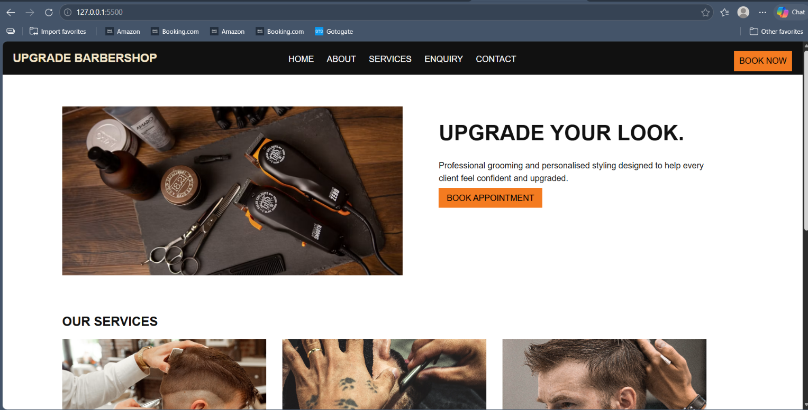
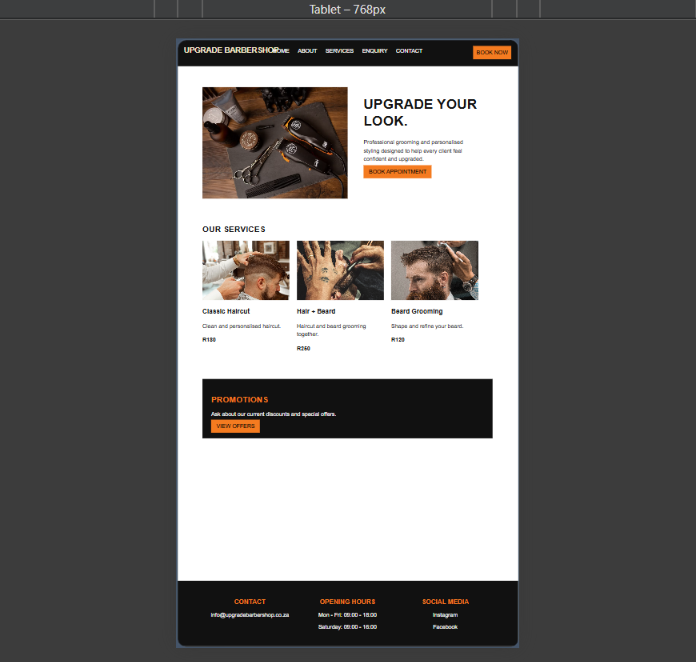
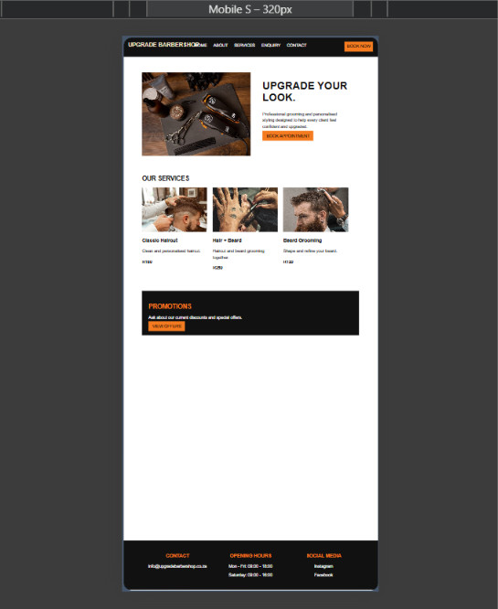

# Upgrade Barbershop Website

# Student Information

**Student Name:** Pedro Henrique LopesAndrade  
**Student Number:** ST10514330
**Course:** HIGHER CERTIFICATE IN MOBILE APPLICATION AND WEB DEVELOPMENT
**Module:** WED5020  
**Year:** 2026  

## Project Overview

Upgrade Barbershop exists as a contemporary digital platform which was built for establishing a professional image for the enterprise. Experts claim that Upgrade Barbershop serves as a method for providing individuals with details regarding the grooming establishment, various offerings, costs, marketing deals, and ways to communicate. A strong internet presence is established through the features of this Upgrade Barbershop because visibility is necessary for the enterprise.

Many people believe that the creation of Upgrade Barbershop assists clients in gaining knowledge about available hair care activities and submitting booking requests through the internet. The visual layout emphasizes a tidy and current look while this style represents the character of a high-quality grooming center. Professionalism is shown by the aesthetic choices within the Upgrade Barbershop interface so that people feel confident in the services.

Upgrade Barbershop was constructed by developers using HTML5 and CSS3 tools. It has been observed that a straightforward and transparent arrangement remains beneficial for both computer users and mobile device owners. Because the structure is simple, Upgrade Barbershop functions efficiently for all people who seek grooming help across various electronic tools.

## Website Goals and Objectives

The main goals of the website are:

- Create a professional online presence for Upgrade Barbershop.
- Allow customers to view available services and prices.
- Make appointment enquiries easier.
- Provide information about the barbershop and its approach.
- Promote special offers and promotions.
- Provide clear contact and location information.
- Attract new customers while maintaining relationships with existing customers.

### Key Performance Indicators (KPIs)

- Increase online visibility.
- Increase customer enquiries.
- Increase appointment requests.
- Improve access to service and pricing information.
- Provide an easy-to-use customer experience.

## Key Features and Functionality

The website includes:

- Homepage with an introduction to the barbershop.
- About page explaining the barbershop and its philosophy.
- Services page displaying available grooming services and prices.
- Enquiry page for customer enquiries.
- Contact page with appointment and contact information.
- Appointment form with service, date and time selections.
- Promotions section.
- Navigation menu connecting all website pages.
- Responsive layout for smaller screens.
- Images supporting the website content.

## Timeline and Milestones

### Part 1 
Milestone	            Task	                                                                 Completion Date
1	                    Select target organisations and define website concepts	                 17 August 2026
2	                    Research organisations and prepare project proposals	                 17 August 2026
3	                    Plan website structure and create low-fidelity wireframes	             19 August 2026
4	                    Develop website structure using HTML and CSS	                         20 August 2026
5	                    Test website, correct errors and refine the design	                     28 August 2026
6  	                    Final review and submission	                                             1 September 2026

## Part 1 Details

Part 1 includes the project proposal, organisation research, content research and sourcing, sitemap, website structure and initial HTML files.

Parts 2 and 3 will follow in future submissions and will include further development and improvements to the website.

---

## Sitemap

  text
Home
│
├── About
│
├── Services
│
├── Enquiry
│
└── Contact
    └── Booking Form

References

Allegro Digital Team, 2026. How Much Does a Website Cost in South Africa? (2026 Price Guide). Available at: https://www.allegrodigital.co.za/articles/how-much-does-website-cost-south-africa (Accessed: 1 September 2026).

Unsplash, n.d. License. Available at: https://unsplash.com/license (Accessed: 1 September 2026).

Unsplash, n.d. *Barbershop styling photograph.* Available at: https://images.unsplash.com/photo-1534297635766-a262cdcb8ee4 (Accessed: 1 September 2026).

Unsplash, n.d. *Classic haircut photograph.* Available at: https://images.unsplash.com/photo-1593702275687-f8b402bf1fb5 (Accessed: 1 September 2026).

Unsplash, n.d. *Regular haircut photograph.* Available at: https://images.unsplash.com/photo-1622287162716-f311baa1a2b8 (Accessed: 1 September 2026).

Pexels, n.d. *Kids haircut photograph.* Available at: https://images.pexels.com/photos/7697477/pexels-photo-7697477.jpeg (Accessed: 1 September 2026).

Pexels, n.d. *Kids haircut photograph.* Available at: https://images.pexels.com/photos/2062463/pexels-photo-2062463.jpeg (Accessed: 1 September 2026).

Pexels, n.d. *Beard grooming photograph.* Available at: https://images.pexels.com/photos/9992819/pexels-photo-9992819.jpeg (Accessed: 1 September 2026).

Pexels, n.d. *Barbershop interior photograph.* Available at: https://images.pexels.com/photos/17665771/pexels-photo-17665771.jpeg (Accessed: 1 September 2026).

Unsplash, n.d. *Barber machines photograph.* Available at: https://images.unsplash.com/photo-1621605815971-fbc98d665033 (Accessed: 1 September 2026).

Unsplash, n.d. *License.* Available at: https://unsplash.com/license (Accessed: 1 September 2026).

AI Declaration

ChatGPT was used to assist with organising and refining some areas of the project to make the final work more professional. The  decisions, content and implementation were taken and reviewed by the student.

## Responsive Design Testing

The website was tested on desktop, tablet and mobile screen sizes.
The layout, navigation, images and content were adjusted to remain
clear and usable across different screen sizes.

### Desktop

### Tablet

### Mobile

The website was tested on desktop, tablet and mobile screen sizes.
The layout, navigation, images and content were adjusted to remain
clear and usable across different screen sizes.

## Changelog

### Phase 2
- Added responsive CSS for tablet and mobile screens.
- Improved navigation on smaller screens.
- Adjusted images and content widths for smaller devices.
- Tested the website on desktop, tablet and mobile screen sizes.